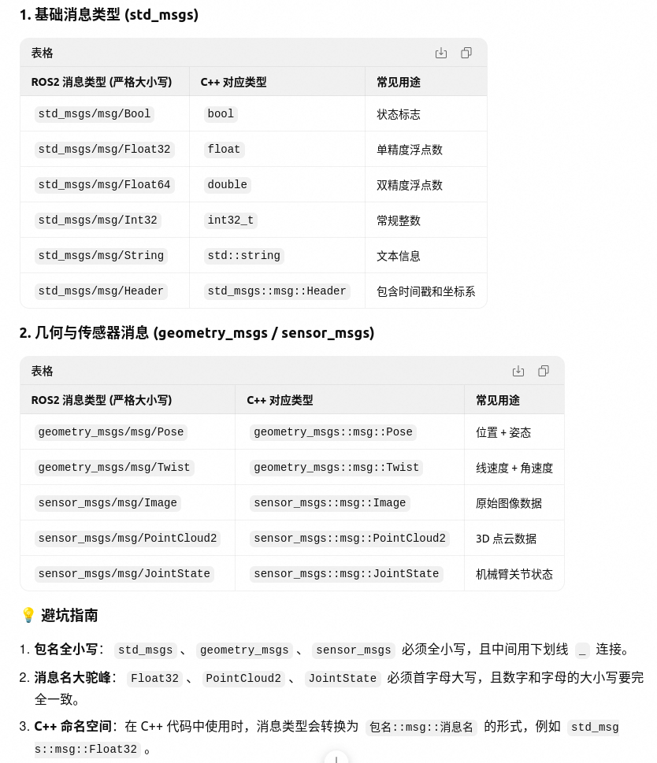

# 第二次作业Review
## Have learned
- **YAML文件到底是个啥**
  一个用缩进表示参数关系的配置文件，可以用于储存参数，相较于JSON和xml有更好的可读性
- **ROS2读参方式**
  浅层来说，launch会让节点知道该去哪个YAML找参数
  深层来说，运行时先加载launch文件，launch中有一个参数叫paramters=['/path/to/YAML'],本质是一个路径，launch可以根据它来找到并把YAML中的参数加载到ROS服务器，然后节点再到ROS服务器去找参数
- **咋配置YAML文件**
  在包下的第一级目录创建config文件夹，在config中创建.yaml文件，YAML在给ROS配置参数时的格式如下：
  ```
  your_node_name:
    ros__parameters:
    parameter_1:value_1
    parameter_2:value_2
    ...
  ```
  手动给YAML文件改参数的命令行：
  ```bash
  ros2 run <package_node> <node_name> --ros-args -p <param>:=<value>
  ```
- **launch文件新增参数**
  使用yaml后launch应该依据这种格式：
  ```python
  from launch import LaunchDescription
  from launch_ros.actions import Node
  
  def generate_launch_decription()
    your_node_name=Node(
      packages= "package_name",
      executable= "node_name",
      namespace= "namespace",
      output= "screen",
      name= "your_node_name",<--需要和yaml文件中的your_node_name
      parameters= ["/path/to/YAML"]
    )
  ```
  注意等号和后面的值之间要留有1个空格

- **C++与ROS2消息类型的对应关系**

  
  ---
- **命名空间**
  假设工程中需要同时启动多个相同节点时使用，一种方法是把原来的节点文件赋值粘贴后重新命名，然后再重新设置launch，过于麻烦;另一种方法是使用命名空间，用于避免节点复制和重命名
  相关命令行如下：
  ```bash
  ros2 run <package_name> <node_name> --ros-args -r __ns=/namespace
  ```
### 第一次编译
- 出现如下报错`CMake Deprecation Warning`即CMake弃用警告，原因是ROS2采用了一种老方式进行编译，也就是`rosidl_target_interfaces()`,实际上对编译没有影响，但这里说明一下，警报的源头位于CMakeList里的接口声明代码
  ```
  rosidl_target_interfaces(sensor_node ${PROJECT_NAME} "rosidl_typesupport_cpp")
  rosidl_target_interfaces(brain_node ${PROJECT_NAME} "rosidl_typesupport_cpp")
  ```
  如果不想看到警告可以把这些代码换为
  ```
  target_link_libraries(sensor_node "${cpp_typesupport_target}")
  target_link_libraries(brain_node "${cpp_typesupport_target}")
  ```
  并在`add_executable`前面加上
  ```
  rosidl_get_typesupport_target(cpp_support_traget ${PROJECT_NAME} "rosidl_support_cpp")
  ```
  
### 第二次编译
- 没有打印subscription的日志，原因是节点名称搞错了